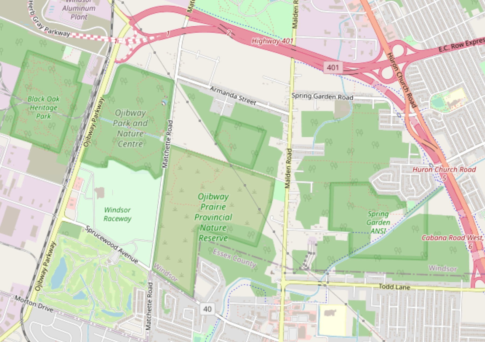

<!-- this is a subheadline -->
&nbsp; &nbsp; Ojibway Prairie Complex (OPC) was once home to the town of Ojibway, which was annexed by the city of Windsor in 1966. This ~350 hectare (ha) complex is made up of five parcels of land: (i) **Ojibway Park** (~61.5 ha); (ii) **Ojibway Prairie Provincial Nature Reserve** (105 ha); (iii) **Tallgrass Prairie Heritage Park** (~15.6 ha); (iv) **Spring Garden ANSI** (~117 ha); and (v) **Black Oak Heritage Park** (~50.6 ha)[@noauthor_ojibway_2019]. Collectively they are home to more than 160 species of provincially rare plants and animals, more than any other site in Ontario. Arguably it is one of Canada's most treasured natural areas.  
&nbsp; &nbsp; Unfortunately, OPC is one of only three major **[Tallgrass Communities](https://tallgrassontario.org/wp-site/)** remaining in the province, with the other two being found in and around **W**alpole **I**sland **F**irst **N**ations (WIFN, ~850 ha) and **P**inery **P**rovincial **P**ark (PPP, ~1250 ha). Together these three areas are thought to account for ~90% of the province’s existing TallGrass Communities (TGC). Historically, Southern Ontario is thought to have contained upwards of 200,000 ha (2,000 km&#178;) of Tallgrass Communities.  
&nbsp; &nbsp; According to Ontario's ecological land classification systems, OPC lies within the **[Southern Great Lakes lowland forests](https://www.ontario.ca/page/ecosystems-ontario-part-1-ecozones-and-ecoregions)** ecoregion of the much larger **Mixedwood Plains** ecozone. And like other parts of the province, the landscape of OPC has been largely shaped by glacial ice and water between 75,000-to-10,000 years ago (i.e. late [Wisconsin glacial period](https://opentextbc.ca/geology/chapter/16-1-glacial-periods-in-earths-history/)). The original topsoil of this region was removed by the enormous grinding and scraping forces generated by the advancing glaciers. Over time the bedrock became covered by thick layers of unconsolidated material (i.e. [surficial geology](https://www.mndm.gov.on.ca/en/mines-and-minerals/geoscience/surficial-geology)) often through the action of glacial meltwater. For OPC the large glacial lakes that once inundated the region left behind a large low-relief plain of sandy and clay-like material known as the **St. Clair Clay Plain**. These glacial deposits have greatly influenced soil development and consequently the variety of plants and animals that it supports.

<!--------------------------------------------------------------------->
&copy; Jeffrey C Howard. The material contained within this website may be copied, distributed and displayed without alterations for noncommercial purposes only provided that it is accompanied by acknowledgements to the author. All commercial and non-commercial rights are reserved to the author.  
<!--------------------------------------------------------------------->

