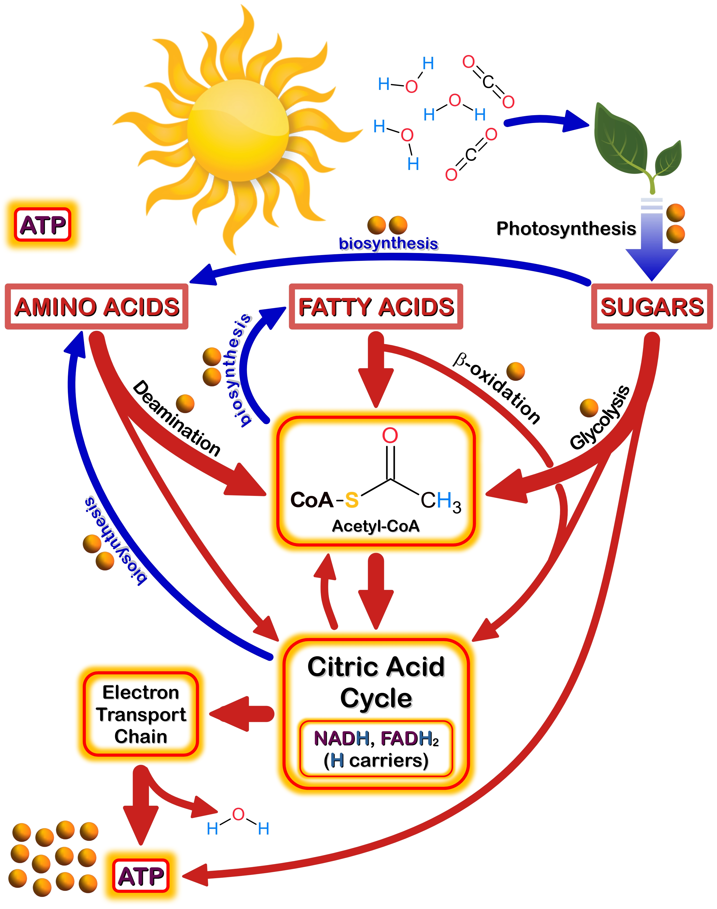

 

  
<b>TABLE OF CONTENTS</b>

  
  1. <a href="#PNP">Overview of Plant Natural Products (PNP)</a>
     * <a href="#Fig_AcCoA">Fig.1: Acetyl-CoA Metabolism</a>
  2. <a href="#BB_PNP">Building Blocks of PNP</a>
     * <a href="#Fig_OoL">Fig. 2: Acetyl-CoA & Origins of Life</a>
     * <a href="#Fig_PNP">Fig. 3: PNP</a>
  7. <a href="#Refs">References</a>

<!---------------------------------------------------------->
<!-------- SECTION 1 - PLANT NATURAL PRODUCTS (PNP) -------->
<!---------------------------------------------------------->
&nbsp; &nbsp; It is quite remarkable that most people around the world still rely on traditional medicine as their primary form of health care.**1,2** This speaks to the important role that Plant Natural Products (PNPs) play in the daily lives of most people around the world. Some of the more storied PNPs include the *analgesic* **<a class="one" href="https://pubchem.ncbi.nlm.nih.gov/compound/5288826">Morphine</a>** and the *anti-malarials* **<a class="one" href="https://www.ebi.ac.uk/chebi/searchId.do?chebiId=CHEBI:15854">Quinine</a>** and **<a class="one" href="https://www.ebi.ac.uk/chebi/searchId.do?chebiId=CHEBI:223316">Artemisinin</a>**. Although the building blocks of PNPs are ultimately derived from **<a class="one" href="https://www.biointeractive.org/classroom-resources/photosynthesis">Photosynthesis</a>**, they do not play a major role in *basal cellular metabolism* (i.e. **primary metabolism**) and were at one time considered "*waste*" products. Fortunately we now know that these **secondary metabolites** play a vital role in the survival of plants, particularly in relation to <u>environmental stresses</u> (e.g. herbivory, pathogens, damaging UV-radiation, water and nutrient shortages). Although there are an enormous number (>200,000) and variety of PNPs, their chemical building blocks are surprisingly few in number, with **<a class="one" href="https://www.ebi.ac.uk/chebi/searchId.do?chebiId=CHEBI:15351">acetyl-Coenzyme A</a>** being perhaps the most important one of all of them (**Fig. 1**). 

<!---------------------------------------------------------------->
<!---------------- FIG 1 - Acetyl-CoA METABOLISM ----------------->
<!---------------------------------------------------------------->

<figure>

<figcaption>
<b>Figure 1: Acetyl-CoA and Cell Metabolism</b>. Acetyl-CoA is a well known product of several <i>catabolic</i> (arrows) pathways, as well as a key <i>anabolic</i> (arrows) metabolite used in the production of lipids. It is also recognized as a key secondary messenger in cells where it is involved in regulating protein translation and gene regulation. As shown above acetyl-CoA can be produced via the breakdown (i.e. <i>catabolism</i>) of <b>sugars</b> (Glycolysis), <b>fatty acids</b> (&beta;-oxidation), and <b>amino acids</b> (deamination/oxidation). The high energy contained within the thioester bond of acetyl-CoA is captured by co-factors known as hydrogen carriers (NADH, NADPH, FADH2) during the <b>Citric Acid Cycle</b>. These molecules carry high energy electrons to the <b><a class="one" href="https://www.biointeractive.org/classroom-resources/electron-transport-chain">Electron Transport Chain</a></b> where they are used in the production of ATP, the main "<i>fuel</i>" of cells. The intermediates of the <b>Citric Acid Cycle</b> are also used in the synthesis of amino acids.
</figcaption>
</figure>

<!-------------------------------------------------->
<!-------- SECTION 2 -- PNP Building Blocks -------->
<!-------------------------------------------------->

1. BUILDING BLOCKS OF PNP**:** Cellular acetyl-CoA serves as an <u>activated</u> carrier of **acetyl** groups (**C**H3**-C=**O), just like ATP is an <u>activated</u> carrier of *phosphoryl* groups (PO3-2). The two carbon (**C**2) **acyl** group (**R-C=**O) attached to acetyl-CoA is *activated* because it is linked to CoA via a <u>high energy</u> **thioester** bond (**Note:** 2 carbon **acetyl** group is the most common **acyl** group linked to CoA). The *Gibbs free energy of hydrolysis* (**&Delta;Go&prime;**) for an **acetyl** group bound to CoA has a high negative value (**&Delta;Go&prime;** = **-35.1 kJ/mol**) that even exceeds that of ATP (**&Delta;Go&prime;** = **-34.54 kJ/mol**, terminal phosphate group). Enzymes often use *exergonic* reactions (i.e. reactions with **&Delta;Go&prime;** < 0 release energy, such as the hydrolysis or "*breaking*" of a high energy **thioester** bond) to carry out *endergonic* reactions (i.e. reactions with **&Delta;Go&prime;** > 0 absorb energy, such as the synthesis of biomolecules). Cellular metabolism is largely made possible by the <u>coupling</u> of *exergonic* reactions with *endergonic* reactions.  
&nbsp; &nbsp; Plants and animals use a number of metabolic pathways to produce acetyl-CoA (**Fig. 1**), but for some anaerobic bacteria acetyl-CoA is the end product of a carbon *fixation* pathway known as the reductive acetyl-CoA or **Wood–Ljungdahl** pathway. This important biochemical pathway reduces **C**O2 using H2 as the electron donor and transition metal co-factors as catalysts.**3** The energetically favourable manner in which this pathway produces acetyl-CoA (i.e. linear, *exergonic* **C**O2 fixation pathway) is of particular interest to **Origins of Life** (OoL) researchers, since the key intermediates of this pathway (i.e. formate, acetate, and pyruvate) can be generated <u>abiotically</u> using the *hydrothermal vent* alloy **awaruite** (Ni3Fe) as a catalyst**4**. The natural ease by which H2 and **C**O2 can be converted to pyruvate (**C**3) using a simple inorganic catalyst provides some level of credibility to the idea that the reductive acetyl-CoA pathway was patterned on naturally occurring *exergonic* reactions found in *submarine hydrothermal vent* systems --- one of the favoured sites for the OoL.**5-9** Of course, when we talk about OoL research most scientists immediately picture the famous **Miller-Urey** experiments of the early 1950s.**10** These two pioneers, who were inspired by the theoretical work of Oparin (1924) and Haldane (1929),**11,12** showed that complex biomolecules, like amino acids, can be synthesized from simple gases (H2, **C**H4, NH3, H2O) using a small electric discharge.**13,14** Although Earth's early atmosphere more than 4 *billion years ago* (**Gya**) was not as *reducing* as Miller's experiments, it did lack free O2 (i.e. *anoxic*) and was therefore mildly *reducing* if not chemically neutral compared to today's atmosphere.**15-17** Although no single environment would have likely provided all of the chemical and physical conditions required for the OoL, few have garnered more attention than submarine hydrothermal vents.**18** Some of these systems, like the *Lost City Hydrothermal Field* (**LCHF**),**19** vent warm (40-75oC) H2 and **C**H4 rich alkaline (pH 9-10) water that reacts with the cold seawater to produce relatively large (10-60 m) chimney-like carbonate structures.**20,21** Submarine vents, like the **LCHF** have presumably existed since the **Hadean**, and the large network of small pores found in them may have served as an ideal "*incubator*" for chemical reactions. The mixing of warm crustal water and cold seawater within these pores would have created temperature and pH gradients that promote the spontaneous *fixation* of **C**O2 (**Fig. 2B**).**22**  

<!--------------------------------------------------------------------->
&copy; Jeffrey C Howard. The material contained within this website may be copied, distributed and displayed without alterations for noncommercial purposes only provided that it is accompanied by acknowledgements to the author. All commercial and non-commercial rights are reserved to the author.  
<!--------------------------------------------------------------------->

REFERENCES**:**  
**1.** Akerele O. (1993). Nature’s Medicinal Bounty: Don’t Throw It Away. World Health Forum 14:390–5.  
**2.** World Health Organization. (2009). Report of WHO Interregional Workshop on the Use of Traditional Medicine in Primary Health Care, Ulaanbaatar, Mongolia, 23-26 August 2007.  
**3.** Ljungdahl L., and Wood H.G. (1965). INCORPORATION OF C14 FROM CARBON DIOXIDE INTO SUGAR PHOSPHATES, CARBOXYLIC ACIDS, AND AMINO ACIDS BY CLOSTRIDIUM THERMOACETICUM. Journal of Bacteriology 89:1055–64. https://doi.org/10.1128/JB.89.4.1055-1064.1965.  
**4.** Martin W.F. (2020). Older Than Genes: The Acetyl CoA Pathway and Origins. Frontiers in Microbiology 11:817. https://doi.org/10.3389/fmicb.2020.00817.  
**5.** Berg I.A., Kockelkorn D., Ramos-Vera W.H., Say R.F., Zarzycki J., Hügler M., et al. (2010). Autotrophic carbon fixation in archaea. Nature Reviews Microbiology 8:447–60. https://doi.org/10.1038/nrmicro2365.  
**6.** Fuchs G. (2011). Alternative pathways of carbon dioxide fixation: Insights into the early evolution of life? Annual Review of Microbiology 65:631–58. https://doi.org/10.1146/annurev-micro-090110-102801.  
**7.** Weiss M.C., Sousa F.L., Mrnjavac N., Neukirchen S, Roettger M, Nelson-Sathi S, et al. (2016). The physiology and habitat of the last universal common ancestor. Nature Microbiology 1:1–8. https://doi.org/10.1038/nmicrobiol.2016.116.  
**8.** Weiss M.C., Preiner M., Xavier J.C., Zimorski V., and Martin W.F. (2018). The last universal common ancestor between ancient Earth chemistry and the onset of genetics. PLOS Genetics 14:e1007518. https://doi.org/10.1371/journal.pgen.1007518.  
**9.** Varma S.J., Muchowska K.B., Chatelain P., and Moran J. (2018). Native iron reduces CO 2 to intermediates and end-products of the acetyl-CoA pathway. Nature Ecology & Evolution 2:1019–24. https://doi.org/10.1038/s41559-018-0542-2.  
**10.** Johnson A.P., Cleaves H.J., Dworkin J.P., Glavin D.P., Lazcano A., and Bada J.L. (2008). The Miller Volcanic Spark Discharge Experiment. Science 322:404–4. https://doi.org/10.1126/science.1161527.  
**11.** Haldane J.B.S. (1929). The origin of life. Rationalist Annual 148:3–10.  
**12.** Oparin A.I. The origin of life. 2d ed. New York: Dover Publications; 1953.  
**13.** Miller S.L. (1953). A Production of Amino Acids Under Possible Primitive Earth Conditions. Science 117:528–9. https://doi.org/10.1126/science.117.3046.528.  
**14.** Miller S.L., and Urey H.C. (1959). Organic compound synthesis on the primitive earth. Science 130:245–51. https://doi.org/10.1126/science.130.3370.245.  
**15.** Zahnle K.J. (2006). Earth’s Earliest Atmosphere. Elements 2:217–22.  
**16.** Zahnle K., Schaefer L., and Fegley B. (2010). Earth’s Earliest Atmospheres. Cold Spring Harbor Perspectives in Biology 2: https://doi.org/10.1101/cshperspect.a004895.  
**17.** Catling D.C., Zahnle K.J. (2020). The Archean atmosphere. Science Advances 6:eaax1420. https://doi.org/10.1126/sciadv.aax1420.  
**18.** Martin W., Baross J., Kelley D., Russell M.J. (2008). Hydrothermal vents and the origin of life. Nature Reviews Microbiology 6:805–14. https://doi.org/10.1038/nrmicro1991.  
**19.** Kelley D.S., Karson J.A., Blackman D.K., Früh-Green G.L., Butterfield D.A., Lilley M.D., et al. (2001). An off-axis hydrothermal vent field near the Mid-Atlantic Ridge at 30° N. Nature 412:145–9. https://doi.org/10.1038/35084000.  
**20.** Früh-Green G.L., Kelley D.S., Bernasconi S.M., Karson J.A., Ludwig K.A., Butterfield D.A., et al. (2003). 30,000 Years of Hydrothermal Activity at the Lost City Vent Field. Science 301:495–8. https://doi.org/10.1126/science.1085582.  
**21.** Kelley D.S., Karson J.A., Früh-Green G.L., Yoerger D.R., Shank T.M., Butterfield D.A., et al. (2005). A Serpentinite-Hosted Ecosystem: The Lost City Hydrothermal Field. Science 307:1428–34. https://doi.org/10.1126/science.1102556.  
**22.** Stevenson D.J. (1987). Origin of the Moon-The Collision Hypothesis. Annual Review of Earth and Planetary Sciences 15:271–315. https://doi.org/10.1146/annurev.ea.15.050187.001415.  
**23.** Mojzsis S.J., Harrison T.M., and Pidgeon R.T. (2001). Oxygen-isotope evidence from ancient zircons for liquid water at the Earth’s surface 4,300 Myr ago. Nature 409:178–81. https://doi.org/10.1038/35051557.  
**24.** Wilde S.A., Valley J.W., Peck W.H., and Graham C.M. (2001). Evidence from detrital zircons for the existence of continental crust and oceans on the Earth 4.4 Gyr ago. Nature 409:175–8. https://doi.org/10.1038/35051550.  
**25.** Harrison T.M., Bell E.A., and Boehnke P. (2017). Hadean Zircon Petrochronology. Reviews in Mineralogy and Geochemistry 83:329–63. https://doi.org/10.2138/rmg.2017.83.11.  
**26.** Schopf J.W. (1993). Microfossils of the Early Archean Apex Chert: New Evidence of the Antiquity of Life. Science 260:640–6. https://doi.org/10.1126/science.260.5108.640.  
**27.** Allwood A.C., Walter M.R., Kamber B.S., Marshall C.P., and Burch I.W. (2006). Stromatolite reef from the Early Archaean era of Australia. Nature 441:714–8. https://doi.org/10.1038/nature04764.  
**28.** Djokic T., Van Kranendonk M.J., Campbell K.A., Walter M.R., and Ward C.R. (2017). Earliest signs of life on land preserved in ca. 3.5 Ga hot spring deposits. Nature Communications 2017;8:15263. https://doi.org/10.1038/ncomms15263.  
**29.** Mojzsis S.J., Arrhenius G., McKeegan K.D., Harrison T.M., Nutman A.P., and Friend C.R.L. (1996). Evidence for life on Earth before 3,800 million years ago. Nature 384:55–9. https://doi.org/10.1038/384055a0.  
**30.** Rosing M.T. (1999). 13C-Depleted Carbon Microparticles in &gt;3700-Ma Sea-Floor Sedimentary Rocks from West Greenland. Science 283:674–6. https://doi.org/10.1126/science.283.5402.674.  

31
Ohtomo Y, Kakegawa T, Ishida A, Nagase T, Rosing MT. Evidence for biogenic graphite in early Archaean Isua metasedimentary rocks. Nature Geoscience 2014;7:25–8. https://doi.org/10.1038/ngeo2025.
32
Bell EA, Boehnke P, Harrison TM, Mao WL. Potentially biogenic carbon preserved in a 4.1 billion-year-old zircon. Proceedings of the National Academy of Sciences of the United States of America 2015;112:14518–21. https://doi.org/10.1073/pnas.1517557112.
33
Tashiro T, Ishida A, Hori M, Igisu M, Koike M, Méjean P, et al. Early trace of life from 3.95 Ga sedimentary rocks in Labrador, Canada. Nature 2017;549:516–8. https://doi.org/10.1038/nature24019.
34
Arndt N, Nisbet E. Processes on the Young Earth and the Habitats of Early Life. Annual Review of Earth and Planetary Sciences 2012. https://doi.org/10.1146/ANNUREV-EARTH-042711-105316.
35
Sagan C, Mullen G. Earth and Mars: Evolution of Atmospheres and Surface Temperatures. Science 1972;177:52–6. https://doi.org/10.1126/science.177.4043.52.
36
Owen T, Cess RD, Ramanathan V. Enhanced CO 2 greenhouse to compensate for reduced solar luminosity on early Earth. Nature 1979;277:640–2. https://doi.org/10.1038/277640a0.
37
Johnson JE, Webb SM, Thomas K, Ono S, Kirschvink JL, Fischer WW. Manganese-oxidizing photosynthesis before the rise of cyanobacteria. Proceedings of the National Academy of Sciences 2013;110:11238–43. https://doi.org/10.1073/pnas.1305530110.
38
Fischer WW, Hemp J, Johnson JE. Evolution of Oxygenic Photosynthesis. Annual Review of Earth and Planetary Sciences 2016;44:647–83. https://doi.org/10.1146/annurev-earth-060313-054810.
39
Preiner M, Igarashi K, Muchowska KB, Yu M, Varma SJ, Kleinermanns K, et al. A hydrogen-dependent geochemical analogue of primordial carbon and energy metabolism. Nature Ecology & Evolution 2020;4:534–42. https://doi.org/10.1038/s41559-020-1125-6.
40
Russell MJ, Martin W. The rocky roots of the acetyl-CoA pathway. Trends in Biochemical Sciences 2004;29:358–63. https://doi.org/10.1016/j.tibs.2004.05.007.
41
Lane N, Allen JF, Martin W. How did LUCA make a living? Chemiosmosis in the origin of life. BioEssays: News and Reviews in Molecular, Cellular and Developmental Biology 2010;32:271–80. https://doi.org/10.1002/bies.200900131.
42
Christianson DW. Chemistry. Roots of biosynthetic diversity. Science (New York, NY) 2007;316:60–1. https://doi.org/10.1126/science.1141630.
43
Abbas F, Ke Y, Yu R, Yue Y, Amanullah S, Jahangir MM, et al. Volatile Terpenoids: Multiple Functions, Biosynthesis, Modulation and Manipulation by Genetic Engineering. Planta 2017;246:803–16. https://doi.org/10.1007/s00425-017-2749-x.
44
Tetali SD. Terpenes and Isoprenoids: A Wealth of Compounds for Global Use. Planta 2019;249:1–8. https://doi.org/10.1007/s00425-018-3056-x.
45
Fäldt J, Arimura G, Gershenzon J, Takabayashi J, Bohlmann J. Functional identification of AtTPS03 as (E)-beta-ocimene synthase: A monoterpene synthase catalyzing jasmonate- and wound-induced volatile formation in Arabidopsis thaliana. Planta 2003;216:745–51. https://doi.org/10.1007/s00425-002-0924-0.
46
Zalucki MP, Brower LP, Alonso‐M A. Detrimental Effects of Latex and Cardiac Glycosides on Survival and Growth of First-Instar Monarch Butterfly Larvae Danaus Plexippus Feeding on the Sandhill Milkweed Asclepias Humistrata. Ecological Entomology 2001;26:212–24. https://doi.org/10.1046/j.1365-2311.2001.00313.x.
47
Li XP, Björkman O, Shih C, Grossman AR, Rosenquist M, Jansson S, et al. A pigment-binding protein essential for regulation of photosynthetic light harvesting. Nature 2000;403:391–5. https://doi.org/10.1038/35000131.
48
Grassmann J. Terpenoids as Plant Antioxidants. Vitamins and Hormones 2005;72:505–35. https://doi.org/10.1016/S0083-6729(05)72015-X.
49
Leverenz RL, Sutter M, Wilson A, Gupta S, Thurotte A, Bourcier de Carbon C, et al. A 12 å carotenoid translocation in a photoswitch associated with cyanobacterial photoprotection. Science (New York, NY) 2015;348:1463–6. https://doi.org/10.1126/science.aaa7234.
50
Araújo ECC, Silveira ER, Lima MAS, Neto MA, Andrade IL de, Lima MAA, et al. Insecticidal Activity and Chemical Composition of Volatile Oils from Hyptis Martiusii Benth. Journal of Agricultural and Food Chemistry 2003;51:3760–2. https://doi.org/10.1021/jf021074s.
51
Regnault-Roger C, Vincent C, Arnason JT. Essential Oils in Insect Control: Low-Risk Products in a High-Stakes World. Annual Review of Entomology 2012;57:405–24. https://doi.org/10.1146/annurev-ento-120710-100554.
52
Tholl D. Biosynthesis and Biological Functions of Terpenoids in Plants. Advances in Biochemical Engineering/Biotechnology 2015;148:63–106. https://doi.org/10.1007/10_2014_295.
53
Pavela R, Benelli G. Essential Oils as Ecofriendly Biopesticides? Challenges and Constraints. Trends in Plant Science 2016;21:1000–7. https://doi.org/10.1016/j.tplants.2016.10.005.
54
Scalerandi E, Flores GA, Palacio M, Defagó MT, Carpinella MC, Valladares G, et al. Understanding Synergistic Toxicity of Terpenes as Insecticides: Contribution of Metabolic Detoxification in Musca Domestica. Frontiers in Plant Science 2018;9: https://doi.org/10.3389/fpls.2018.01579.
55
Kwok-Keung Fung B, Stryer L. Photolyzed rhodopsin catalyzes the exchange of GTP for bound GDP in retinal rod outer segments. Proceedings of the National Academy of Sciences of the United States of America 1980;77:2500–4. https://doi.org/10.1073/pnas.77.5.2500.
56
Liebman PA, Pugh ENJ. ATP mediates rapid reversal of cyclic GMP phosphodiesterase activation in visual receptor membranes. Nature 1980;287:734–6. https://doi.org/10.1038/287734a0.
57
Kühn H, Bennett N, Michel-Villaz M, Chabre M. Interactions between photoexcited rhodopsin and GTP-binding protein: Kinetic and stoichiometric analyses from light-scattering changes. Proceedings of the National Academy of Sciences of the United States of America 1981;78:6873–7. https://doi.org/10.1073/pnas.78.11.6873.
58
Wilden U, Hall SW, Kühn H. Phosphodiesterase activation by photoexcited rhodopsin is quenched when rhodopsin is phosphorylated and binds the intrinsic 48-kDa protein of rod outer segments. Proceedings of the National Academy of Sciences of the United States of America 1986;83:1174–8. https://doi.org/10.1073/pnas.83.5.1174.
59
Palczewski K, Buczyłko J, Kaplan MW, Polans AS, Crabb JW. Mechanism of rhodopsin kinase activation. The Journal of Biological Chemistry 1991;266:12949–55.
60
Palczewski K. Chemistry and biology of vision. The Journal of Biological Chemistry 2012;287:1612–9. https://doi.org/10.1074/jbc.R111.301150.
61
Strickland S, Mahdavi V. The induction of differentiation in teratocarcinoma stem cells by retinoic acid. Cell 1978;15:393–403. https://doi.org/10.1016/0092-8674(78)90008-9.
62
Tickle C, Alberts B, Wolpert L, Lee J. Local application of retinoic acid to the limb bond mimics the action of the polarizing region. Nature 1982;296:564–6. https://doi.org/10.1038/296564a0.
63
Gudas LJ, Wagner JA. Retinoids regulate stem cell differentiation. Journal of Cellular Physiology 2011;226:322–30. https://doi.org/10.1002/jcp.22417.
64
Rhinn M, Dollé P. Retinoic acid signalling during development. Development (Cambridge, England) 2012;139:843–58. https://doi.org/10.1242/dev.065938.
65
Cunningham TJ, Duester G. Mechanisms of retinoic acid signalling and its roles in organ and limb development. Nature Reviews Molecular Cell Biology 2015;16:110–23. https://doi.org/10.1038/nrm3932.
66
Ghyselinck NB, Duester G. Retinoic acid signaling pathways. Development (Cambridge, England) 2019;146: https://doi.org/10.1242/dev.167502.
67
Roberts C. Regulating Retinoic Acid Availability during Development and Regeneration: The Role of the CYP26 Enzymes. Journal of Developmental Biology 2020;8: https://doi.org/10.3390/jdb8010006.
68
Giguere V, Ong ES, Segui P, Evans RM. Identification of a receptor for the morphogen retinoic acid. Nature 1987;330:624–9. https://doi.org/10.1038/330624a0.
69
Petkovich M, Brand NJ, Krust A, Chambon P. A human retinoic acid receptor which belongs to the family of nuclear receptors. Nature 1987;330:444–50. https://doi.org/10.1038/330444a0.
70
Niederreither K, Subbarayan V, Dollé P, Chambon P. Embryonic retinoic acid synthesis is essential for early mouse post-implantation development. Nature Genetics 1999;21:444–8. https://doi.org/10.1038/7788.
71
Duester G. Retinoic acid synthesis and signaling during early organogenesis. Cell 2008;134:921–31. https://doi.org/10.1016/j.cell.2008.09.002.
72
Hosler D, Burkett SL, Tarkanian MJ. Prehistoric Polymers: Rubber Processing in Ancient Mesoamerica. Science 1999;284:1988. https://doi.org/10.1126/science.284.5422.1988.
73
American Chemical Society National Historic Chemical Landmarks. U.S. Synthetic Rubber Program, 1939-1945. 2019.
74
Pickard WF. Laticifers and Secretory Ducts: Two Other Tube Systems in Plants. The New Phytologist 2008;177:877–88. https://doi.org/10.1111/j.1469-8137.2007.02323.x.
75
Castelblanque L, Balaguer B, Martí C, Rodríguez JJ, Orozco M, Vera P. Multiple Facets of Laticifer Cells. Plant Signaling & Behavior 2017;12: https://doi.org/10.1080/15592324.2017.1300743.
76
Ramos MV, Demarco D, Costa Souza IC da, Freitas CDT de. Laticifers, Latex, and Their Role in Plant Defense. Trends in Plant Science 2019;24:553–67. https://doi.org/10.1016/j.tplants.2019.03.006.
77
Dussourd DE, Eisner T. Vein-Cutting Behavior: Insect Counterploy to the Latex Defense of Plants. Science (New York, NY) 1987;237:898–901. https://doi.org/10.1126/science.3616620.
78
Dussourd DE. Behavioral Sabotage of Plant Defense: Do Vein Cuts and Trenches Reduce Insect Exposure to Exudate? Journal of Insect Behavior 1999;12:501–15. https://doi.org/10.1023/A:1020966807633.
79
Zalucki M, Brower LP. Survival of First Instar Larvae of Danaus Plexippus (Lepidoptera: Danainae) in Relation to Cardiac Glycoside and Latex Content ofAsclepias Humistrata (Asclepiadaceae). CHEMOECOLOGY 1992;3:81–93. https://doi.org/10.1007/BF01245886.
80
Farmer EE, Ryan CA. Octadecanoid Precursors of Jasmonic Acid Activate the Synthesis of Wound-Inducible Proteinase Inhibitors. The Plant Cell 1992;4:129–34. https://doi.org/10.1105/tpc.4.2.129.
81
Schittko U, Preston CA, Baldwin IT. Eating the Evidence? Manduca Sexta Larvae Can Not Disrupt Specific Jasmonate Induction in Nicotiana Attenuata by Rapid Consumption. Planta 2000;210:343–6. https://doi.org/10.1007/PL00008143.
82
Turner JG, Ellis C, Devoto A. The Jasmonate Signal Pathway. The Plant Cell 2002;14 Suppl:S153–164. https://doi.org/10.1105/tpc.000679.
83
Rasmann S, Agrawal A, C Cook S, C Erwin A. Cardenolides, Induced Responses, and Interactions between above- and Belowground Herbivores of Milkweed (Asclepias Spp.). Ecology 2009;90:2393–404. https://doi.org/10.1890/08-1895.1.
84
Agrawal AA, Hastings AP, Patrick ET, Knight AC. Specificity of Herbivore-Induced Hormonal Signaling and Defensive Traits in Five Closely Related Milkweeds (Asclepias Spp.). Journal of Chemical Ecology 2014;40:717–29. https://doi.org/10.1007/s10886-014-0449-6.
85
Castelblanque L, Balaguer B, Marti C, Orozco M, Vera P. LOL2 and LOL5 Loci Control Latex Production by Laticifer Cells in Euphorbia Lathyris. The New Phytologist 2018;219:1467–79. https://doi.org/10.1111/nph.15253.
86
Agrawal A, Petschenka A, Bingham R, Weber M, Rasmann S. Toxic Cardenolides: Chemical Ecology and Coevolution of Specialized Plant-Herbivore Interactions. The New Phytologist 2012;194:28–45. https://doi.org/10.1111/j.1469-8137.2011.04049.x.
87
Dobler S, Petschenka G, Wagschal V, Flacht L. Convergent Adaptive Evolution – How Insects Master the Challenge of Cardiac Glycoside-Containing Host Plants. Entomologia Experimentalis Et Applicata 2015;157:30–9. https://doi.org/10.1111/eea.12340.
88
Canada H. Summary Safety Review - Lanoxin, Toloxin, Apo-Digoxin, PMS-Digoxin, (Digoxin) - Assessing the Potential Higher Risk of Death Compared to Patients Not Using Digoxin. Aem 2014.
89
Vaughan GL, Jungreis AM. Insensitivity of Lepidopteran Tissues to Ouabain: Physiological Mechanisms for Protection from Cardiac Glycosides - ScienceDirect. Journal of Insect Physiology 1977;23:585–9.
90
Bodemann HH. The Current Concept for the Cardiac Glycoside Receptor. Clinical Cardiology 1981;4:223–8. https://doi.org/10.1002/clc.4960040502.
91
Holzinger F, Wink M. Mediation of Cardiac Glycoside Insensitivity in the Monarch Butterfly (Danaus Plexippus): Role of an Amino Acid Substitution in the Ouabain Binding Site of Na(+),K (+)-ATPase. Journal of Chemical Ecology 1996;22:1921–37. https://doi.org/10.1007/BF02028512.
92
Dobler S, Dalla S, Wagschal V, Agrawal AA. Community-Wide Convergent Evolution in Insect Adaptation to Toxic Cardenolides by Substitutions in the Na,K-ATPase. Proceedings of the National Academy of Sciences of the United States of America 2012;109:13040–5. https://doi.org/10.1073/pnas.1202111109.
93
Liu J, Tian J, Haas M, Shapiro JI, Askari A, Xie Z. Ouabain Interaction with Cardiac Na+/K+-ATPase Initiates Signal Cascades Independent of Changes in Intracellular Na+ and Ca2+ Concentrations. The Journal of Biological Chemistry 2000;275:27838–44. https://doi.org/10.1074/jbc.M002950200.
94
Haas M, Askari A, Xie Z. Involvement of Src and Epidermal Growth Factor Receptor in the Signal-Transducing Function of Na+/K+-ATPase. The Journal of Biological Chemistry 2000;275:27832–7. https://doi.org/10.1074/jbc.M002951200.
95
Tian J, Cai T, Yuan Z, Wang H, Liu L, Haas M, et al. Binding of Src to Na+/K+-ATPase Forms a Functional Signaling Complex. Molecular Biology of the Cell 2006;17:317–26. https://doi.org/10.1091/mbc.e05-08-0735.
96
Schoner W, Scheiner-Bobis G. Endogenous and Exogenous Cardiac Glycosides: Their Roles in Hypertension, Salt Metabolism, and Cell Growth. American Journal of Physiology Cell Physiology 2007;293:C509–536. https://doi.org/10.1152/ajpcell.00098.2007.
97
Dvela M, Rosen H, Ben-Ami HC, Lichtstein D. Endogenous Ouabain Regulates Cell Viability. American Journal of Physiology Cell Physiology 2012;302:C442–452. https://doi.org/10.1152/ajpcell.00336.2011.
98
Clausen MV, Hilbers F, Poulsen H. The Structure and Function of the Na,K-ATPase Isoforms in Health and Disease. Frontiers in Physiology 2017;8: https://doi.org/10.3389/fphys.2017.00371.
99
Nyblom M, Poulsen H, Gourdon P, Reinhard L, Andersson M, Lindahl E, et al. Crystal structure of Na+, K(+)-ATPase in the Na(+)-bound state. Science (New York, NY) 2013;342:123–7. https://doi.org/10.1126/science.1243352.
100
El Mernissi G, Doucet A. Quantitation of [3H]Ouabain Binding and Turnover of Na-K-ATPase along the Rabbit Nephron. The American Journal of Physiology 1984;247:F158–167. https://doi.org/10.1152/ajprenal.1984.247.1.F158.
101
Attwell D, Laughlin SB. An Energy Budget for Signaling in the Grey Matter of the Brain. Journal of Cerebral Blood Flow and Metabolism: Official Journal of the International Society of Cerebral Blood Flow and Metabolism 2001;21:1133–45. https://doi.org/10.1097/00004647-200110000-00001.
102
Dobler S, Petschenka G, Pankoke H. Coping with Toxic Plant Compounds–the Insect’s Perspective on Iridoid Glycosides and Cardenolides. Phytochemistry 2011;72:1593–604. https://doi.org/10.1016/j.phytochem.2011.04.015.
103
Price EM, Lingrel JB. Structure-Function Relationships in the Na,K-ATPase Alpha Subunit: Site-Directed Mutagenesis of Glutamine-111 to Arginine and Asparagine-122 to Aspartic Acid Generates a Ouabain-Resistant Enzyme. Biochemistry 1988;27:8400–8. https://doi.org/10.1021/bi00422a016.
104
Price EM, Rice DA, Lingrel JB. Structure-Function Studies of Na,K-ATPase. Site-Directed Mutagenesis of the Border Residues from the H1-H2 Extracellular Domain of the Alpha Subunit. The Journal of Biological Chemistry 1990;265:6638–41.
105
Zhen Y, Aardema ML, Medina EM, Schumer M, Andolfatto P. Parallel Molecular Evolution in an Herbivore Community. Science (New York, NY) 2012;337:1634–7. https://doi.org/10.1126/science.1226630.
106
Ujvari B, Casewell NR, Sunagar K, Arbuckle K, Wüster W, Lo N, et al. Widespread Convergence in Toxin Resistance by Predictable Molecular Evolution. Proceedings of the National Academy of Sciences of the United States of America 2015;112:11911–6. https://doi.org/10.1073/pnas.1511706112.
107
Petschenka G, Fei CS, Araya JJ, Schroder S, Timmermann BN, Agrawal AA. Relative Selectivity of Plant Cardenolides for Na(+)/K(+)-ATPases From the Monarch Butterfly and Non-Resistant Insects. Frontiers in Plant Science 2018;9:1424. https://doi.org/10.3389/fpls.2018.01424.
108
Malcolm SB, Brower LP. Evolutionary and Ecological Implications of Cardenolide Sequestration in the Monarch Butterfly. Experientia 1989;45:284–95. https://doi.org/10.1007/BF01951814.
109
Zust T, Petschenka G, Hastings AP, Agrawal AA. Toxicity of Milkweed Leaves and Latex: Chromatographic Quantification Versus Biological Activity of Cardenolides in 16 Asclepias Species. Journal of Chemical Ecology 2019;45:50–60. https://doi.org/10.1007/s10886-018-1040-3.
110
Wilkins MR, Kendall MJ, Wade OL. William Withering and Digitalis, 1785 to 1985. British Medical Journal 1985;290:7–8. https://doi.org/10.1136/bmj.290.6461.7.
111
Cattell M, Gold H. The Influence of Digitalis Glucosides on the Force of Contraction of Mammalian Cardiac Muscle. Journal of Pharmacology and Experimental Therapeutics 1938;62:116–25.
112
Hamlyn JM, Ringel R, Schaeffer J, Levinson PD, Hamilton BP, Kowarski AA, et al. A Circulating Inhibitor of (Na+/K+)ATPase Associated with Essential Hypertension. Nature 1982;300:650–2. https://doi.org/10.1038/300650a0.
113
Ludens JH, Clark MA, DuCharme DW, Harris DW, Lutzke BS, Mandel F, et al. Purification of an Endogenous Digitalislike Factor from Human Plasma for Structural Analysis. Hypertension (Dallas, Tex: 1979) 1991;17:923–9. https://doi.org/10.1161/01.hyp.17.6.923.
114
Peng M, Huang L, Xie Z, Huang WH, Askari A. Partial Inhibition of Na+/K+-ATPase by Ouabain Induces the Ca2+-Dependent Expressions of Early-Response Genes in Cardiac Myocytes. The Journal of Biological Chemistry 1996;271:10372–8. https://doi.org/10.1074/jbc.271.17.10372.
115
Aizman O, Uhlén P, Lal M, Brismar H, Aperia A. Ouabain, a Steroid Hormone That Signals with Slow Calcium Oscillations. Proceedings of the National Academy of Sciences of the United States of America 2001;98:13420–4. https://doi.org/10.1073/pnas.221315298.
116
Gao J, Wymore RS, Wang Y, Gaudette GR, Krukenkamp IB, Cohen IS, et al. Isoform-Specific Stimulation of Cardiac Na/K Pumps by Nanomolar Concentrations of Glycosides. The Journal of General Physiology 2002;119:297–312. https://doi.org/10.1085/jgp.20028501.
117
Haas M, Wang H, Tian J, Xie Z. Src-Mediated Inter-Receptor Cross-Talk between the Na+/K+-ATPase and the Epidermal Growth Factor Receptor Relays the Signal from Ouabain to Mitogen-Activated Protein Kinases. Journal of Biological Chemistry 2002;277:18694–702. https://doi.org/10.1074/jbc.M111357200.
118
Liang M, Cai T, Tian J, Qu W, Xie Z. Functional Characterization of Src-Interacting Na/K-ATPase Using RNA Interference Assay. Journal of Biological Chemistry 2006;281:19709–19. https://doi.org/10.1074/jbc.M512240200.
119
Liang M, Tian J, Liu L, Pierre S, Liu J, Shapiro J, et al. Identification of a Pool of Non-Pumping Na/K-ATPase. The Journal of Biological Chemistry 2007;282:10585–93. https://doi.org/10.1074/jbc.M609181200.
120
Mijatovic T, Roland I, Van Quaquebeke E, Nilsson B, Mathieu A, Van Vynckt F, et al. The Alpha1 Subunit of the Sodium Pump Could Represent a Novel Target to Combat Non-Small Cell Lung Cancers. The Journal of Pathology 2007;212:170–9. https://doi.org/10.1002/path.2172.
121
Takara K, Takagi K, Tsujimoto M, Ohnishi N, Yokoyama T. Digoxin Up-Regulates Multidrug Resistance Transporter (MDR1) mRNA and Simultaneously down-Regulates Steroid Xenobiotic Receptor mRNA. Biochemical and Biophysical Research Communications 2003;306:116–20. https://doi.org/10.1016/s0006-291x(03)00922-7.
122
Cerella C, Dicato M, Diederich M. Assembling the Puzzle of Anti-Cancer Mechanisms Triggered by Cardiac Glycosides. Mitochondrion 2013;13:225–34. https://doi.org/10.1016/j.mito.2012.06.003.
123
Shiratori O. Growth Inhibitory Effect of Cardiac Glycosides and Aglycones on Neoplastic Cells: In Vitro and in Vivo Studies. Gan 1967;58:521–8.
124
Stenkvist B, Bengtsson E, Eriksson O, Holmquist J, Nordin B, Westman-Naeser S, et al. Cardiac Glycosides and Breast Cancer. The Lancet 1979;313:563. https://doi.org/10.1016/S0140-6736(79)90996-6.
125
Stenkvist B, Bengtsson E, Eklund G, Eriksson O, Holmquist J, Nordin B, et al. Evidence of a Modifying Influence of Heart Glucosides on the Development of Breast Cancer. Analytical and Quantitative Cytology 1980;2:49–54.
126
Stenkvist B. Is Digitalis a Therapy for Breast Carcinoma? Oncology Reports 1999;6:493–6.
127
Johansson S, Lindholm P, Gullbo J, Larsson R, Bohlin L, Claeson P. Cytotoxicity of Digitoxin and Related Cardiac Glycosides in Human Tumor Cells. Anti-Cancer Drugs 2001;12:475–83.
128
Lindholm P, Gullbo J, Claeson P, Göransson U, Johansson S, Backlund A, et al. Selective Cytotoxicity Evaluation in Anticancer Drug Screening of Fractionated Plant Extracts. Journal of Biomolecular Screening 2002;7:333–40. https://doi.org/10.1177/108705710200700405.
129
Johnson PH, Walker RP, Jones SW, Stephens K, Meurer J, Zajchowski DA, et al. Multiplex Gene Expression Analysis for High-Throughput Drug Discovery: Screening and Analysis of Compounds Affecting Genes Overexpressed in Cancer Cells. Molecular Cancer Therapeutics 2002;1:1293–304.
130
Newman RA, Yang P, Pawlus AD, Block KI. Cardiac Glycosides as Novel Cancer Therapeutic Agents. Molecular Interventions 2008;8:36–49. https://doi.org/10.1124/mi.8.1.8.
131
Botelho AFM, Pierezan F, Soto-Blanco B, Melo MM. A Review of Cardiac Glycosides: Structure, Toxicokinetics, Clinical Signs, Diagnosis and Antineoplastic Potential. Toxicon 2019;158:63–8. https://doi.org/10.1016/j.toxicon.2018.11.429.
132
ClinicalTrialsGov. 2019.
133
Galluzzi L, Buqué A, Kepp O, Zitvogel L, Kroemer G. Immunological Effects of Conventional Chemotherapy and Targeted Anticancer Agents. Cancer Cell 2015;28:690–714. https://doi.org/10.1016/j.ccell.2015.10.012.
134
Menger L, Vacchelli E, Adjemian S, Martins I, Ma Y, Shen S, et al. Cardiac Glycosides Exert Anticancer Effects by Inducing Immunogenic Cell Death. Science Translational Medicine 2012;4:143ra99. https://doi.org/10.1126/scitranslmed.3003807.
135
Yuan B, He J, Kisoh K, Hayashi H, Tanaka S, Si N, et al. Effects of Active Bufadienolide Compounds on Human Cancer Cells and CD4+CD25+Foxp3+ Regulatory T Cells in Mitogen-Activated Human Peripheral Blood Mononuclear Cells. Oncology Reports 2016;36:1377–84. https://doi.org/10.3892/or.2016.4946.
136
Agrawal AA, Konno K. Latex: A Model for Understanding Mechanisms, Ecology, and Evolution of Plant Defense against Herbivory. Annu Rev Ecol Evol Syst 2009;40:311–31.
137
Rawlings ND, Barrett AJ. Evolutionary families of peptidases. Biochemical Journal 1993;290:205–18. https://doi.org/10.1042/bj2900205.
138
López-Otín C, Bond JS. Proteases: Multifunctional Enzymes in Life and Disease. The Journal of Biological Chemistry 2008;283:30433–7. https://doi.org/10.1074/jbc.R800035200.
139
Hoorn RAL van der. Plant Proteases: From Phenotypes to Molecular Mechanisms. Annual Review of Plant Biology 2008;59:191–223. https://doi.org/10.1146/annurev.arplant.59.032607.092835.
140
Blow DM. The tortuous story of Asp…His…Ser: Structural analysis of α-chymotrypsin. Trends in Biochemical Sciences 1997;22:405–8. https://doi.org/10.1016/S0968-0004(97)01115-8.
141
Schaller A. A Cut above the Rest: The Regulatory Function of Plant Proteases. Planta 2004;220:183–97. https://doi.org/10.1007/s00425-004-1407-2.
142
Domsalla A, Melzig MF. Occurrence and Properties of Proteases in Plant Latices. Planta Medica 2008;74:699–711. https://doi.org/10.1055/s-2008-1074530.
143
Berger J, Asenjo CF. ANTHELMINTIC ACTIVITY OF CRYSTALLINE PAPAIN. Science (New York, NY) 1940;91:387–8. https://doi.org/10.1126/science.91.2364.387.
144
Starley IF, Mohammed P, Schneider G, Bickler SW. The Treatment of Paediatric Burns Using Topical Papaya. Burns: Journal of the International Society for Burn Injuries 1999;25:636–9. https://doi.org/10.1016/s0305-4179(99)00056-x.
145
Maurer HR. Bromelain: Biochemistry, Pharmacology and Medical Use. Cellular and Molecular Life Sciences: CMLS 2001;58:1234–45. https://doi.org/10.1007/PL00000936.
146
Yaakobi T, Cohen-Hadar N, Yaron H, Hirszowicz E, Simantov Y, Bass A, et al. Wound Debridement by Continuous Streaming of Proteolytic Enzyme Solutions: Effects on Experimental Chronic Wound Model in Porcin. Wounds: A Compendium of Clinical Research and Practice 2007;19:192–200.
147
Rosenberg L, Shoham Y, Krieger Y, Rubin G, Sander F, Koller J, et al. Minimally Invasive Burn Care: A Review of Seven Clinical Studies of Rapid and Selective Debridement Using a Bromelain-Based Debriding Enzyme (Nexobrid®). Annals of Burns and Fire Disasters 2015;28:264–74.
148
Chobotova K, Vernallis AB, Majid FAA. Bromelain’s Activity and Potential as an Anti-Cancer Agent: Current Evidence and Perspectives. Cancer Letters 2010;290:148–56. https://doi.org/10.1016/j.canlet.2009.08.001.
149
Rathnavelu V, Alitheen NB, Sohila S, Kanagesan S, Ramesh R. Potential Role of Bromelain in Clinical and Therapeutic Applications. Biomedical Reports 2016;5:283–8. https://doi.org/10.3892/br.2016.720.
150
Iram S, Zahera M, Wahid I, Baker A, Raish M, Khan A, et al. Cisplatin Bioconjugated Enzymatic GNPs Amplify the Effect of Cisplatin with Acquiescence. Scientific Reports 2019;9:13826. https://doi.org/10.1038/s41598-019-50215-y.
151
Winnick T, Davis AR, Greenberg DM. PHYSICOCHEMICAL PROPERTIES OF THE PROTEOLYTIC ENZYME FROM THE LATEX OF THE MILKWEED, ASCLEPIAS SPECIOSA TORR. SOME COMPARISONS WITH OTHER PROTEASES : I. CHEMICAL PROPERTIES, ACTIVATION-INHIBITION, pH-ACTIVITY, AND TEMPERATURE-ACTIVITY CURVES. The Journal of General Physiology 1940;23:275–88. https://doi.org/10.1085/jgp.23.3.275.
152
Lowry B, Lee D, Hébant C. The Origin of Land Plants: A New Look at an Old Problem. Taxon 1980;29:183–97. https://doi.org/10.2307/1220280.
153
Weng J-K, Chapple C. The Origin and Evolution of Lignin Biosynthesis. The New Phytologist 2010;187:273–85. https://doi.org/10.1111/j.1469-8137.2010.03327.x.
154
Stafford HA. Flavonoid Evolution: An Enzymic Approach. Plant Physiology 1991;96:680–5. https://doi.org/10.1104/pp.96.3.680.
155
Gould K, Lister C. Flavonoid Functions in Plants. Flavonoids: Chemistry, Biochemistry and Applications. 2006. p. 397–441.
156
Harborne J, Simmonds N. Natural Distribution of the Phenolic Aglycones. In: HARBORNE JB(Ed), editor. Biochemistry of Phenolic Compounds. London: Academic Press; 1964. p. 77–128.
157
Tzin V, Galili G. The Biosynthetic Pathways for Shikimate and Aromatic Amino Acids in Arabidopsis Thaliana. The Arabidopsis Book / American Society of Plant Biologists 2010;8: https://doi.org/10.1199/tab.0132.
158
Werner RA, Rossmann A, Schwarz C, Bacher A, Schmidt H-L, Eisenreich W. Biosynthesis of Gallic Acid in Rhus Typhina: Discrimination between Alternative Pathways from Natural Oxygen Isotope Abundance. Phytochemistry 2004;65:2809–13. https://doi.org/10.1016/j.phytochem.2004.08.020.
159
Muir RM, Ibáñez AM, Uratsu SL, Ingham ES, Leslie CA, McGranahan GH, et al. Mechanism of Gallic Acid Biosynthesis in Bacteria (Escherichia Coli) and Walnut (Juglans Regia). Plant Molecular Biology 2011;75:555–65. https://doi.org/10.1007/s11103-011-9739-3.
160
Daglia M, Di Lorenzo A, Nabavi SF, Talas ZS, Nabavi SM. Polyphenols: Well beyond the Antioxidant Capacity: Gallic Acid and Related Compounds as Neuroprotective Agents: You Are What You Eat! Current Pharmaceutical Biotechnology 2014;15:362–72. https://doi.org/10.2174/138920101504140825120737.
161
Boerjan W, Ralph J, Baucher M. Lignin Biosynthesis. Annual Review of Plant Biology 2003;54:519–46. https://doi.org/10.1146/annurev.arplant.54.031902.134938.
162
Agrawal AA, Salminen J-P, Fishbein M. Phylogenetic Trends in Phenolic Metabolism of Milkweeds (Asclepias): Evidence for Escalation. Evolution 2009;63:663–73. https://doi.org/10.1111/j.1558-5646.2008.00573.x.
163
Lattanzio V. Phenolic Compounds. Natural Products 2013:1543–80.
164
Hibbett D, Blanchette R, Kenrick P, Mills B. Climate, Decay, and the Death of the Coal Forests. Current Biology: CB 2016;26:R563–7. https://doi.org/10.1016/j.cub.2016.01.014.
165
Floudas D, Binder M, Riley R, Barry K, Blanchette RA, Henrissat B, et al. The Paleozoic Origin of Enzymatic Lignin Decomposition Reconstructed from 31 Fungal Genomes. Science 2012;336:1715–9. https://doi.org/10.1126/science.1221748.
166
Robinson JM. Lignin, Land Plants, and Fungi: Biological Evolution Affecting Phanerozoic Oxygen Balance. Geology 1990;18:607–10. https://doi.org/10.1130/0091-7613(1990)018<0607:LLPAFB>2.3.CO;2.
167
Haribal M, Renwick JA. Oviposition Stimulants for the Monarch Butterfly: Flavonol Glycosides from Asclepias Curassavica. Phytochemistry 1996;41:139–44. https://doi.org/10.1016/0031-9422(95)00511-0.
168
Haribal M, Renwick JA. Identification and Distribution of Oviposition Stimulants for Monarch Butterflies in Hosts and Nonhosts. Journal of Chemical Ecology 1998;24:891–904. https://doi.org/10.1023/A:1022377618562.
169
Baur R, Haribal M, Renwick JA, Stabler A. Contact Chemoreception Related to Oviposition Behavior in the Monarch Butterfly, Danaus Plexippus. Physiological Entomology 1997.

