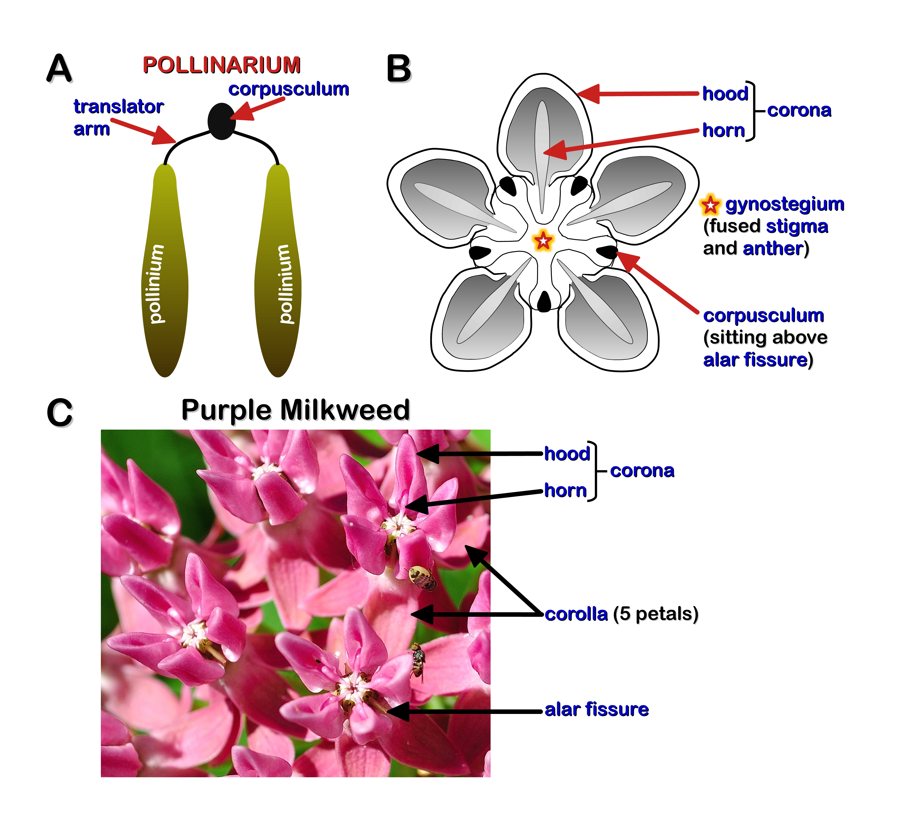
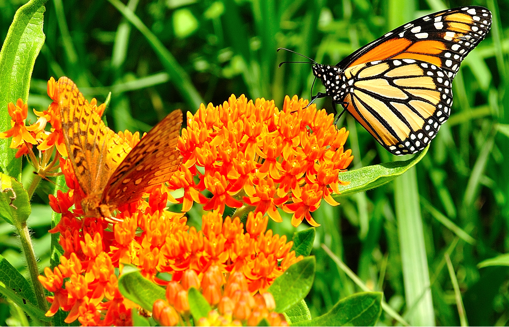
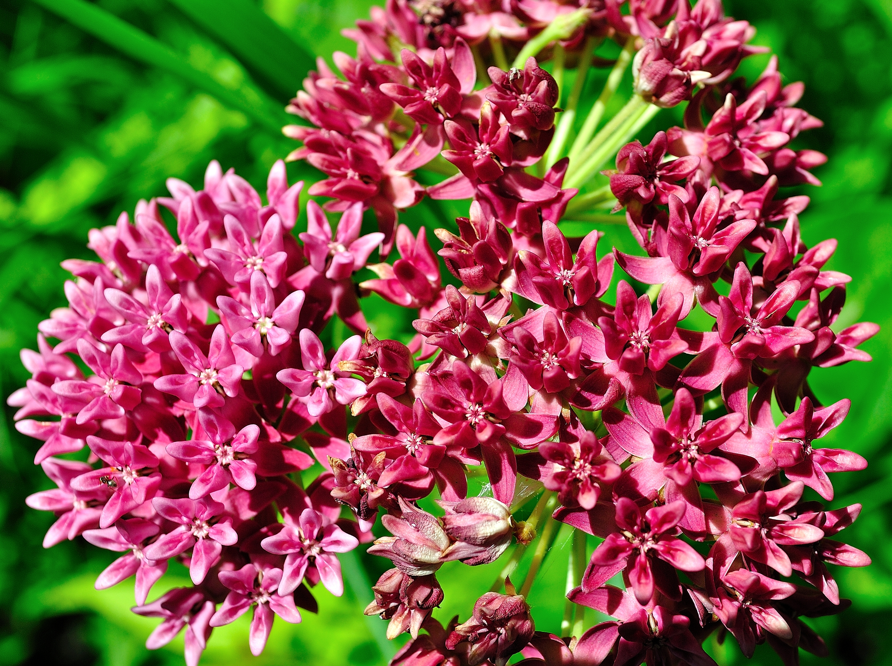
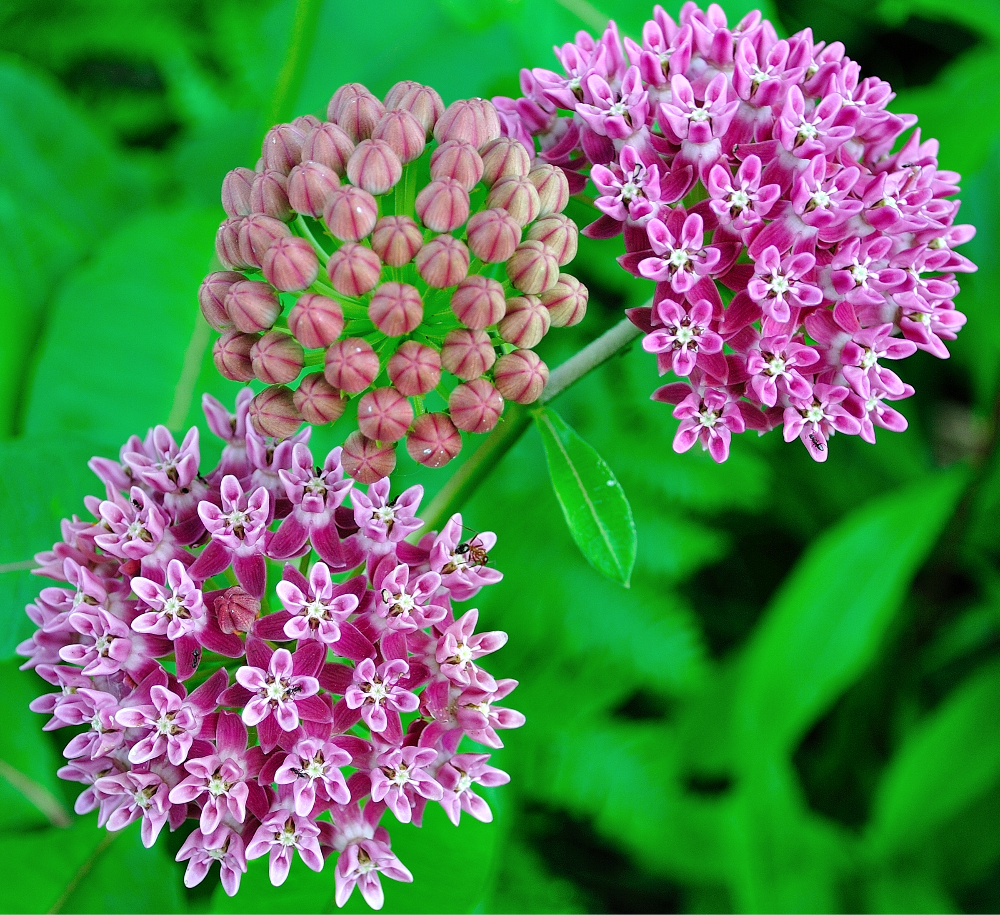

  
<b>TABLE OF CONTENTS</b>

  
  1. <a href="#Mkw">The Allure of Milkweeds</a>
  2. <a href="#Mkw_Pop">OPC Milkweed Population</a>
     * <a href="#Mkw_Ont">Table 1. Milkweeds of Ontario</a>
  3. <a href="#Mkw_Hab">Milkweed Habitat</a>
  4. <a href="#Mkw_Morph">Milkweed Morphology</a>
     * <a href="#Fig_MkwFlower">Fig.1 Milkweed Flower Structure</a>
  5. OPC Milkweeds
     * <a href="#Photo_OM">Orange Milkweed</a>
     * <a href="#Photo_PM">Purple Milkweed</a>
     * <a href="#Photo_SM">Swamp Milkweed</a>
     * <a href="#Photo_CM">Common Milkweed</a>
  6. <a href="#GSrank">Floral Abundance: Global & Regional Rankings</a>
  7. <a href="#Refs2">References</a>

<h2>THE ALLURE OF MILKWEEDS</h2></centre>
  

&nbsp; &nbsp; We have long been taught to despise weeds. They compete with crops for precious nutrients, often reducing their yields in the process. Moreover, they are hard to manage or eradicate. So it is perhaps no surprise that Milk*weed*, the common name given to plants belonging to the genus *Asclepias*, are demonized by most people. The so called *weediness* of these plants is due, in large part, to the ability of some Milkweed species to colonize road sides and other disturbed areas. However, this characterization is misleading due to the fact that many species of *Asclepias* are important sources of food, fibre and medicine.  
&nbsp; &nbsp; We have learned from **First Nations** people that different parts of the **Milkweed** plant can be used for many purposes. For example, the tough stem fibres can be used to make cordage. By simply rubbing the inner stem fibres together between your hands (i.e. *twining* the fibres) one can make a cord. Although most **Milkweeds** are suitable for making cordage, **<a class="one" href="https://explorer.natureserve.org/Taxon/ELEMENT_GLOBAL.2.129944/Asclepias_incarnata">Swamp Milkweed</a>**  (*Asclepias incarnata*) is preferred due to its very tough fibers. **Milkweed** is also edible. The young leaves, shoots and stems of **<a class="one" href="https://explorer.natureserve.org/Taxon/ELEMENT_GLOBAL.2.131135/Asclepias_syriaca">Common Milkweed</a>** (*Asclepias syriaca*), as well as its flower buds, roots and young pods are all considered quite delicious and nutritious greens. **First Nations** people also knew of the healing properties of **Milkweeds**. For example, many parts of the plant, including its **latex**, were used to treat among other things: **(i)** body aches (e.g. back, chest, stomach); **(ii)** venereal diseases and fungal infections (e.g. *ringworm*); and **(iii)** *dropsy* -- a build up of body fluid (aka *edema*) commonly associated with congestive heart failure.**1,2** Today, we now know that Cardiac Glycosides (CG) found in Milkweed **latex** is responsible for its toxic effects on cardiac muscle (see details below). The toxic **latex** was also used by indigenous tribes in both Africa and South America to make poison-tipped arrows. Despite its poisonous nature, **Milkweeds** also provide many other valuable *ecosystem goods* and *services*.**3** For example, the hollow filament-like hairs attached to the seeds, commonly referred to as *coma*, "*floss*" or simply "*silk*", are not only hypoallergenic, but warmer than wool and more buoyant than cork. Moreover, the fine, silky quality of the *coma* (aka: *American silk*) inspired early French settlers (17^th^ century) to make beautiful cloth. Besides the aesthetic qualities of *coma*, its buoyant properties were also put to good use by the Allies during the Second World War as a substitute for *kapok* (aka: "*Java cotton*", from the Kapok tree *Ceiba pentandra*) to make life jackets. The warm and hypo-allergenic properties of **Milkweed** *coma* have also been put to good use in the making of linen and garments (e.g. **<a class="one" href="https://www.ogallalacomfort.com/">Ogallala Comfort</a>**). Not to be out done, the hollow fibres of the *coma* are also highly oil-absorbent and therefore useful for treating oil spills. Lastly, from an ecological view point, **Milkweeds** are host to many insect species, including the emblematic **Monarch Butterfly**. The large volume of nectar these flowering plants produce is a vital food source for many pollinator species, including hummingbirds. Moreover, there are quite a few passerines, like the **<a class="one" href="https://www.allaboutbirds.org/guide/Baltimore_Oriole">Baltimore Oriole</a>** (*Icterus galbula*) and **<a class="one" href="https://www.allaboutbirds.org/guide/American_Goldfinch/">American Goldfinch</a>** (*Spinus tristis*), that use Milkweed floss and/or fibre to build their nests. So, given the wealth of things **Milkweeds** provide -- *why would we not cultivate them*?

<h3>MILKWEED FAMILY</h3></centre>
  
 
<!----------------------------------------------------------------------->
<!----------------- SECTION 1 - OPC MILKWEED POPULATION ----------------->
<!----------------------------------------------------------------------->
 **1. <u>MILKWEED POPULATION</u>:** *Asclepias spp.* are a large family (>70 species) of North American forbs (see **<a class="one" href="https://plants.sc.egov.usda.gov/core/profile?symbol=ASCLE">USDA</a>**), with 12 species being native to Ontario. Of these dozen *Asclepias* species only seven have historically been found at OPC. However, one species (i.e. White Milkweed) is now believed to be *extirpated* (i.e. extinct from region, [Read more about S and G Species Rankings](#sgranks)).  

<!---------------------------------------------------------------->
<!------------------------- TABLE 1: Milkweed sp.----------------->
<!---------------------------------------------------------------->

<!---------------------------------------------------------------->
<!------------------- SECTION 2: MILKWEED HABITAT----------------->
<!---------------------------------------------------------------->
**2.<u>HABITAT</u>:** **Milkweeds** that are native to OPC are perennial, herbaceous plants that inhabit a variety of wet and dry areas, ranging from roadside ditches and swamps to shorelines and forests. Some species, notably *A. syriaca*, readily colonize disturbed areas such as roadsides and abandoned fields. Regardless, one should always consult reliable databases for the preferred habitat of each species (**<a class="one" href="https://plants.sc.egov.usda.gov/core/profile?symbol=ASCLE)">USDA</a>)**, or **<a class="one" href="https://www.itis.gov/">ITIS</a>)**).  

<!------------------------------------------------------------->
<!---------- MILKWEED FAMILY SECTION 3: PLANT MORPH ----------->
<!------------------------------------------------------------->
**3. <u>MILKWEED MORPHOLOGY \& FEATURES</u>:** **Milkweeds**, as the name suggests, are known for their sticky, often *creamy white* (but can be yellow, orange or clear) **latex** that is exuded in response to tissue damage. Closer examination of **latex** shows that it is unlike plant **sap** or **resin** in a number of ways. Firstly, **sap** is an aqueous solution that is transported by the plant's well known vasculature elements (xylem and phloem), while **resins** are a fat-soluble mixture of largely volatile Terpenoids and Phenolics found within *inter*-cellular spaces, or ducts.**4** By contrast, **latex** is produced and stored (under pressure) in *living cells* known as **lactifers**. These elongated and branching cells form *unique* tubular networks throughout most of the plant (i.e. independent of the vascular bundles). In addition, **latex** is an <u>emulsion</u>, or *colloidal* solution that has microscopic particles of **<a class="one" href="https://pubchem.ncbi.nlm.nih.gov/compound/6557">polyisoprene</a>** (i.e. *natural rubber*) suspended within an aqueous solution.**5-7**  
&nbsp; &nbsp; In addition to *natural rubber*, **latex** contains a wide variety of *bioactive* compounds that make the plant inedible to most animals.**6-8** The most notable of these bioactive compounds are the Cardiac Glycosides (CG), digestive Proteases and Phenolics. However, some herbivores, notably Monarch caterpillars (*Danaus plexoppus*), are *obligate* feeders of Milkweed. In fact, this specialization on Milkweed plants has been adopted by over 100 insect species, largely as a mode of chemical defense against predators.**9** In addition to the plant's characteristic sticky **latex**, **Milkweeds** have unique flowers and pod-like fruits. The latter are packed with silky <u>haired</u> seeds that are adapted for wind dispersal (also buoyant in water), while the flowers display very distinctive and complex features (**Fig. 1**).  
<!---------------------------------------------------------------------------->
<!-------------------- FIG 1 - MILKWEED FLOWER STRUCTURE --------------------->
<!---------------------------------------------------------------------------->

<figure>

<figcaption><b>Figure 1: Milkweed Flower Structure.</b> <b>(A)</b> The <b>pollinarium</b> is a <i>winged</i> or "<i>wishbone</i>" shaped structure that contains two discrete sacs of pollen, or <b>pollinium</b>, that are joined to a central disc-like <b>corpusculum</b> via the <i>arms</i> of the <b>translator</b>. <b>(B)</b> This overhead cartoon view of a Milkweed flower shows the general shape and position of the flower elements, including the <i>coronal</i> <b>hood</b> and <b>horn</b> (nectar reservoir) and the position of the <b>corpusculum</b> in relation to the much larger <b>gynostegium</b> (&#9734;fused female <b>stigma</b> and male <b>anther</b>). <b>(C)</b> This picture of Purple Milkweed flowers shows some of its floral elements, including 5 backward pointing (reflected) petals that make up the <b>corolla</b>.  
</figcaption>
</figure>  

&nbsp; &nbsp; **Milkweed** flowers are arranged in either flat-topped or round clusters called *umbels* (i.e. latin *umbella*: "*a sunshade, parasol or umbrella*"). Individual flowers have two distinctive parts -- a lower <u>*corolla*</u> and upper <u>*corona*</u> (**Fig. 1**). The lower *corolla* is made up of 5 backward-pointing (usually) petals, while the upper nectar containing *corona* is composed (usually) of 5 pairs of <u>*hoods*</u> and <u>*horns*</u>. The *hoods* extend from the base of the *stamens* and house a horn-like appendage (nectar reservoir) that arches over top of a central *gem*-like *gynostegium* (fused female *stigma* and male *anthers*). This unusual flower structure results in an equally unusual pollination mechanism. Like orchids, the pollen of **Milkweed** is packaged into discrete units called <u>*pollinia*</u>. They are part of *wishbone*-like structure called a <u>*pollinarium*</u> that contains a pair of *pollinium*, a <u>*translator*</u> and <u>*corpusculum*</u>. The *pollinia* are connected to the *corpusculum*, a small disc-like gland at the base of the "*wishbone*", via the forking "*arms*" of the *translator*. Visually, the *corpusculum* (apex of the *pollinarium*) sits atop a narrow opening (<u>*alar fissure*</u>) into the <u>*stigmatic chamber*</u>, which houses the *pollinarium* (**Fig. 1**). When the leg of a feeding insect slips between the *hoods* and comes into contact with the *corpusculum* it can free the *pollinia* and carry it to other **Milkweed** plants. Given the arduous nature of the **<a class="one" href="https://www.fs.usda.gov/wildflowers/pollinators/importance.shtml">pollination</a>** process, only relatively large insects are capable of carrying out this task.  

<!----------------------------------------------------------------->
<!-------------------- PHOTOS OF MILKWEED sp. --------------------->
<!----------------------------------------------------------------->

**1. ORANGE MILKWEED:** (S4, G5)  
<figure>

<figcaption>
<b>Figure 2.</b> Edwards' Hairstreak, Monarch and Great Spangled Fritillary Butterflies feeding on Orange Milkweed.
</figcaption>
</figure>

This beautiful plant is noted for its umbel-like cluster of small orange flowers. As shown in the above the flowers of this species have a typical *hood* and *horn* corona structure. Other distinctive features of this plant include a hairy stem and alternatively arranged leaves.

**POPULATION:** Orange Milkweed (*aka* Butterflyweed, Butterfly Milkweed, Pleurisy Root) is one of the few native orange wildflowers, making it relatively easy to spot when it blooms (mid-to-late June) in areas containing dry open soils. It is a relatively common plant at **OPC** where it grows singly or in small clusters. This forb is only found in Ontario (common) and Quebec (rare) within Canada, but is a well established perennial plant of eastern North America.

**ECOLOGICAL \& MEDICINAL PROPERTIES:** Orange Milkweed is an important indicator species of healthy prairie habitats with reported medicinal properties (**Note:** the genus, *Asclepias*, refers to the Greek god of medicine *Asklepios*). First Nations People were known to chew the plant root as a cure for pleurisy and other pulmonary ailments, as well as make tea to treat diarrhea and stomach ailments. From an evolutionary perspective, the flat-top *umbel* arrangement of flowers provides a convenient resting platform for pollinating insects to feed on its nectar. This is just one way that plants have co-evolved with insects to promote pollination.  

**2. PURPLE MILKWEED:** (S2, G4G5)  
<figure>

<figcaption>
<b>Figure 3.</b> As the flower umbels mature they take on a deeper purple colour.
</figcaption>
</figure>

**POPULATION \& HABITAT:** This *Asclepias* species is a native perennial forb that grows primarily in Eastern North America. Unlike Orange or Common Milkweed, it rarely grows in large colonies and prefers partly shaded habitats (e.g. Oak Savannahs). As the name suggests, the flowers take on a beautiful deep magenta colour as they mature.

**ECOLOGICAL \& MEDICINAL PROPERTIES:** Similar to **OM**, *Asclepias purpurascens L.* (i.e. Purple Milkweed, **PM**) attracts many type of pollinator species, including among others bees, butterflies and hummingbirds. They also share a similar flower structure (i.e. *corolla* - 5 reflected petals, *corona* - 5 pairs of hoods and down curved horns) and like other Milkweeds produce a white latex that contains toxic **CG**.

---
**REFERENCES:**  
**1.** Moerman D.E. (1986). Medicinal Plants of Native Americans. University of Michigan Museum of Anthropology technical report. (19):534.  
**2.** Kindscher K. (1992). Medicinal wild plants of the Prairie: An Ethnobotanical guide. University Press of Kansas.  
**3.** Costanza R., d'Arge R., De Groot R., Farber S., Grasso M., Hannon B., Limburg K., Naeem S., O'neill R.V., Paruelo J. and Raskin R.G. (1997). The value of the world's ecosystem services and natural capital. Nature 387(6630):253-260.  
**4.** Langenheim, J.H. (2003). Plant Resins: Chemistry, Evolution, Ecology and Ethnobotany. Publisher: Timber Press Inc.,Portland, Oregon, 612 pages.  
**5.** Pickard W.F. (2008). Laticifers and secretory ducts: two other tube systems in plants. New Phytologist 177(4):877-888.  
**6** Castelblanque L., Balaguer B., Martí C., Rodríguez J.J., Orozco M. and Vera P. (2017). Multiple facets of laticifer cells. Plant Signaling & Behavior 12(7):p.e1300743.  
**7.** Ramos M.V., Demarco D., da Costa Souza I.C. and de Freitas C.D.T. (2019). Laticifers, latex, and their role in plant defense. Trends in Plant Science, 24(6):553-567.  
**8.** Agrawal A.A. and Konno K. (2009). Latex: a model for understanding mechanisms, ecology, and evolution of plant defense against herbivory. Annu. Rev. Ecol. Evol. Syst. 40:311-331.  
**9.** Dobler S., Petschenka G., Wagschal V. and Flacht L. (2015). Convergent adaptive evolution–how insects master the challenge of cardiac glycoside‐containing host plants. Entomologia Experimentalis et Applicata 157(1):30-39.  
**10.** 

